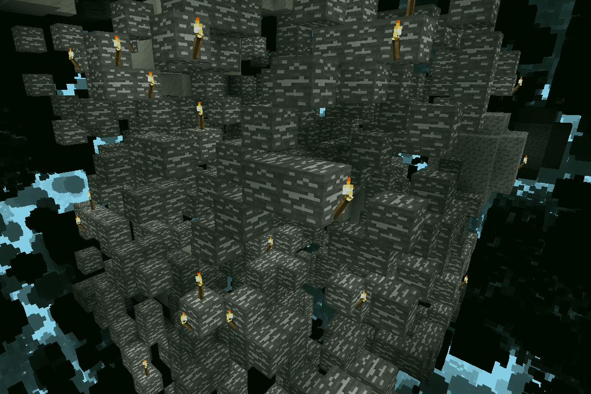

# Elephant Veins

A mod for Minetest ([https://minetest.net](https://minetest.net)) that modifies
ore generation to replace the small sporadic ore pockets with sparse, gigantic
ore veins.

The size, density, and frequency of ore veins are configurable in the settings
menu.

Currently compatible with the following games:

- Mintest Game - [https://content.minetest.net/packages/Minetest/minetest_game](https://content.minetest.net/packages/Minetest/minetest_game)
- Mineclonia - [https://content.minetest.net/packages/ryvnf/mineclonia](https://content.minetest.net/packages/ryvnf/mineclonia)

It should theoretically work with VoxeLibre
([https://content.minetest.net/packages/Wuzzy/mineclone2](https://content.minetest.net/packages/Wuzzy/mineclone2))
too, but it only seems to generate iron and copper in the overworld.

When playing with Mineclonia, I recommend using the following settings instead
of the defaults:

- Vein scarcity multiplier - 350.
- Vein ore count multiplier - 1000.
- Vein size multiplier - 10.

## How to install

Place this directory, symlink it, into the mods folder in your Minetest
directory.

## How to test

Dependencies:

- luacheck - [https://github.com/lunarmodules/luacheck](https://github.com/lunarmodules/luacheck)

There is a `flake.nix` you can use with `nix develop path:.` to generate a
development enviroment.

Then, run the following command(s):

```sh
luacheck .
```

## API

There is an API for other mods to register their ores with Elephant Veins, see
`src/api.lua` for details.
